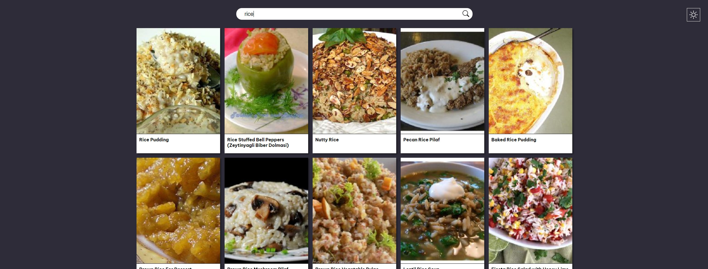

# Plant Based

Web application based on the [spoonacular API](https://spoonacular.com/food-api) that allows users to browse vegetarian recipes.

The app is available at: https://start2impact-plantbased.web.app/

## Built with:
The project was bootstrapped with [Create React App](https://github.com/facebook/create-react-app).
It uses:
- HTML & CSS
- Javascript
- [ReactJS](https://reactjs.org/)
- [Axios](https://www.npmjs.com/package/axios) to make easier to read HTTP requests
- [React Router](https://reactrouter.com/) to serve multiple routes without a back end

Hosting provided by: [Firebase](https://firebase.google.com/)

## How to use:
To try the application you can simply visit the [website](https://start2impact-plantbased.web.app/), search for the name of a dish or an ingredient and start browsing recipes!

Clicking on a recipe card opens a new page with an ingredient list and an instruction list.

---
To run the project locally you can: 
- `git clone` the [repository](https://github.com/sbaglivi/plant-based)
- `npm i` to install the node package dependencies
- `npm start` to serve a development build on the default path (localhost:3000)

## Created by:
[Simone Baglivi](https:/github.com/sbaglivi)
